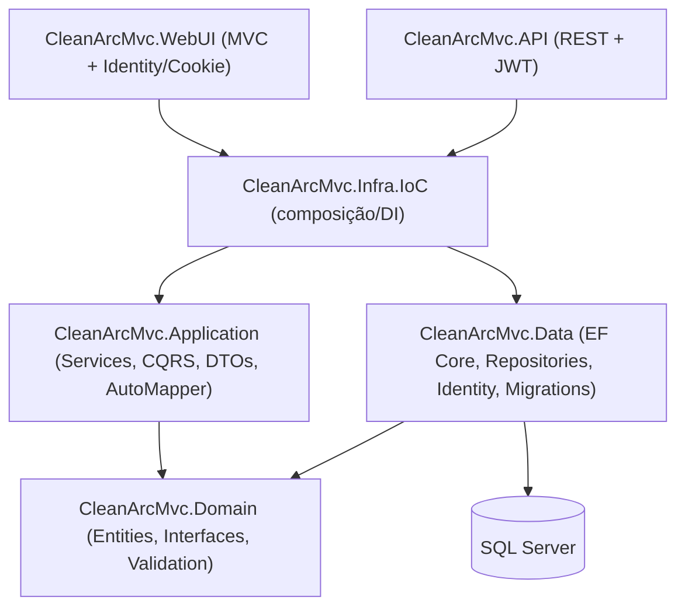

# CleanArcMvc

Aplicação .NET 5 de gestão de produtos e categorias, estruturada em camadas (Domain, Application, Infra.Data, Infra.IoC) e exposta através de dois front-ends: uma aplicação **ASP.NET Core MVC** (com autenticação de usuários) e uma **Web API REST** protegida por JWT (com documentação Swagger).

## Sobre o projeto

O projeto implementa um CRUD de **Produtos** e **Categorias**, com relacionamento um-para-muitos entre as duas entidades. O mesmo domínio e a mesma camada de aplicação são reutilizados por dois pontos de entrada distintos:

- `CleanArcMvc.WebUI`: aplicação MVC com Razor Views, autenticação baseada em cookies (ASP.NET Core Identity) e controle de acesso por papéis (`Admin`, `User`).
- `CleanArcMvc.API`: Web API RESTful protegida por JWT Bearer, com Swagger/OpenAPI configurado para autenticação via token.

O propósito do repositório é demonstrativo/didático: aplicar na prática conceitos de separação em camadas, injeção de dependência centralizada, validações de domínio, CQRS (parcial) com MediatR, AutoMapper e autenticação com ASP.NET Core Identity + JWT. É adequado como referência de estudo e como peça de portfólio técnico.

**Estágio atual**: funcional para o cenário de CRUD de Produtos/Categorias e autenticação, mas com características de projeto de estudo — sem testes de integração, sem containerização e com segredos de exemplo versionados em `appsettings.json` (ver [Configuração](#configuração)).

## Principais funcionalidades

- CRUD completo de **Categorias** (`CategoriesController` no MVC e na API).
- CRUD completo de **Produtos** (`ProductsController` no MVC e na API), incluindo associação a uma categoria e exibição de imagem armazenada em `wwwroot/images`.
- Autenticação de usuários na aplicação MVC via ASP.NET Core Identity (login, registro e logout), com cookie de autenticação.
- Autorização por papéis na aplicação MVC: o controller de Produtos exige o papel `Admin` (`[Authorize(Roles = "Admin")]`).
- Geração de token JWT via `POST /api/Token/LoginUser` e proteção dos controllers da API com `[Authorize]`.
- Seed automático de papéis (`Admin`, `User`) e de dois usuários de exemplo na inicialização da aplicação MVC (`ISeedUserRoleInitial`).
- Seed de dados inicial de categorias via migration (`SeedProducts`).
- Documentação interativa da API via Swagger, com suporte a informar o token JWT diretamente na interface.
- Validações de domínio nas entidades `Product` e `Category` (nome obrigatório, tamanho mínimo/máximo, preço e estoque não negativos), cobertas por testes unitários em `CleanArcMvc.Domain.Tests`.

- **CQRS com MediatR** está implementado apenas para `Product` (`CleanArcMvc.Application/Products/Commands`, `Queries`, `Handlers`, orquestrados por `ProductService`). O fluxo de `Category` (`CategoryService`) ainda acessa o repositório diretamente, sem passar pelo MediatR — ou seja, a migração para CQRS não foi concluída para todas as entidades.

## Tecnologias utilizadas

- **Backend**: .NET 5 / ASP.NET Core 5 (MVC e Web API)
- **Persistência**: Entity Framework Core 5 (Code First), SQL Server
- **Autenticação/Autorização**: ASP.NET Core Identity, JWT Bearer (`Microsoft.AspNetCore.Authentication.JwtBearer`)
- **Padrões e bibliotecas de aplicação**: MediatR (CQRS parcial), AutoMapper
- **Documentação de API**: Swashbuckle / Swagger (OpenAPI), com suporte a autenticação Bearer na UI
- **Testes**: xUnit, FluentAssertions, coverlet.collector (testes de domínio)
- **Frontend**: Razor Views (ASP.NET Core MVC), Bootstrap/jQuery (bibliotecas em `wwwroot/lib`)

## Arquitetura

O projeto segue uma separação em camadas inspirada em Clean Architecture, com o domínio isolado de detalhes de infraestrutura e dois hosts (MVC e API) reutilizando a mesma camada de aplicação:



- `CleanArcMvc.Domain`: entidades (`Product`, `Category`), contratos de repositório e autenticação, e validações de domínio (`DomainExceptionValidation`).
- `CleanArcMvc.Application`: DTOs, `AutoMapper` profiles, serviços de aplicação (`ProductService`, `CategoryService`) e os Commands/Queries/Handlers do MediatR para `Product`.
- `CleanArcMvc.Data`: `ApplicationDbContext`, mapeamentos de entidade (`EntitiesConfiguration`), repositórios, integração com Identity e migrations do EF Core.
- `CleanArcMvc.Infra.IoC`: ponto único de registro de dependências (`DependencyInjection`, `DependencyInjectionAPI`, `DependencyInjectionJWT`, `DependencyInjectionSwagger`), consumido tanto pelo MVC quanto pela API.
- `CleanArcMvc.WebUI` e `CleanArcMvc.API`: hosts de apresentação, cada um com seu próprio `Startup`/`Program`, mas compartilhando domínio e aplicação.

## Estrutura do projeto

```
CleanArcMvc.sln
CleanArcMvc.API/            # Web API REST protegida por JWT + Swagger
CleanArcMvc.WebUI/          # Aplicação MVC com Identity (cookie) e Views Razor
CleanArcMvc.Application/    # DTOs, Services, CQRS (Commands/Queries/Handlers), AutoMapper
CleanArcMvc.Domain/         # Entidades, interfaces de repositório, validações
CleanArcMvc.Data/           # DbContext, Repositories, Identity, Migrations (EF Core)
CleanArcMvc.Infra.IoC/      # Registro de dependências (DI) compartilhado entre MVC e API
CleanArcMvc.Domain.Tests/   # Testes unitários de domínio (xUnit + FluentAssertions)
docs/                       # Documentação complementar
```

## Pré-requisitos

- .NET SDK compatível com **.NET 5** (`TargetFramework` net5.0 em todos os `.csproj`).

  > `TODO: confirmar` — .NET 5 atingiu fim de suporte oficial pela Microsoft; certifique-se de ter o SDK correspondente instalado para compilar o projeto sem alterações.
- SQL Server acessível (local, Express ou instância remota) para os bancos usados pelo EF Core.
- Ferramenta `dotnet-ef` (ou EF Core Tools do Visual Studio) para aplicar migrations, caso o banco ainda não exista.

## Configuração

### Connection string

`CleanArcMvc.WebUI/appsettings.json` e `CleanArcMvc.API/appsettings.json` definem, cada um, uma `ConnectionStrings:DefaultConnection` apontando para uma instância SQL Server local do autor original. Antes de executar o projeto, ajuste esse valor para o seu ambiente, por exemplo:

```json
"ConnectionStrings": {
  "DefaultConnection": "Server=SEU_SERVIDOR;Database=CleanArcMvcDB;Trusted_Connection=True;"
}
```

### JWT (somente `CleanArcMvc.API`)

`CleanArcMvc.API/appsettings.json` contém uma seção `Jwt` (`SecretKey`, `Issuer`, `Audience`) usada para assinar e validar os tokens. **O valor atualmente versionado no repositório é um segredo de exemplo e não deve ser usado em produção.** Substitua por um valor forte e mantenha-o fora do controle de versão em cenários reais (variável de ambiente, User Secrets ou cofre de segredos), por exemplo:

```json
"Jwt": {
  "SecretKey": "SUBSTITUA_POR_UM_VALOR_SECRETO_FORTE",
  "Issuer": "seu-issuer",
  "Audience": "sua-audience"
}
```

### Usuários e papéis (aplicação MVC)

Ao iniciar, `CleanArcMvc.WebUI` executa `ISeedUserRoleInitial` e cria automaticamente os papéis `User` e `Admin`, além de dois usuários de exemplo com senha pré-definida em `CleanArcMvc.Data/Identity/SeedUserRoleInitial.cs`. Esses usuários existem apenas para fins de demonstração; troque as credenciais antes de qualquer uso além do ambiente local. `TODO: confirmar` — nenhum arquivo `.env`/`secrets.json` foi encontrado no repositório; toda a configuração observada está nos `appsettings*.json`.

## Como executar

1. **Clonar o repositório**

   ```bash
   git clone <url-do-repositorio>
   cd CleanArcMvc
   ```

2. **Configurar** a connection string e (para a API) a seção `Jwt`, conforme [Configuração](#configuração).

3. **Preparar o banco de dados** (a partir da pasta que contém `CleanArcMvc.Data`, com `dotnet-ef` instalado):

   ```bash
   dotnet ef database update --project CleanArcMvc.Data --startup-project CleanArcMvc.WebUI
   ```

   As migrations existentes criam as tabelas `Categories`/`Products` (com seed de 3 categorias), as tabelas do ASP.NET Core Identity e ajustes de schema subsequentes.

4. **Executar a aplicação MVC**:

   ```bash
   dotnet run --project CleanArcMvc.WebUI
   ```

   Por padrão (`launchSettings.json`), a aplicação sobe em `https://localhost:5001` / `http://localhost:5000`.

5. **Executar a Web API** (em outro terminal, se desejar rodar os dois hosts simultaneamente):

   ```bash
   dotnet run --project CleanArcMvc.API
   ```

   Também configurada para `https://localhost:5001` / `http://localhost:5000` em `launchSettings.json` — ajuste as portas caso rode API e MVC ao mesmo tempo.

6. **Acessar a aplicação**:
   - MVC: navegue até a URL informada no console (rota padrão `Home/Index`; login em `/Account/Login`).
   - API: a Swagger UI abre automaticamente (`launchUrl: swagger`) em `/swagger`.

## API

- **URL base**: definida pelo host configurado em `launchSettings.json`/ambiente de execução da `CleanArcMvc.API` (ex.: `https://localhost:5001/api`).
- **Autenticação**: JWT Bearer. Obtenha um token em `POST /api/Token/LoginUser` informando `email` e `password` de um usuário válido; todos os demais endpoints exigem o header `Authorization: Bearer <token>` (configurado em `DependencyInjectionJWT` e refletido no Swagger).
- **Swagger/OpenAPI**: disponível em `/swagger` quando em ambiente de desenvolvimento (`Startup.cs` da API), com botão "Authorize" para informar o token Bearer.
- **Grupos de endpoints**:
  - `api/Token` — geração de token (`LoginUser`).
  - `api/Products` — CRUD de produtos.
  - `api/Categories` — CRUD de categorias.

Detalhes de rotas e exemplos de payload estão em [docs/API.md](docs/API.md).

## Banco de dados

- **Tecnologia**: SQL Server, acessado via Entity Framework Core 5 (Code First).
- **Schema**: gerenciado por migrations em `CleanArcMvc.Data/Migrations` (`Inicial`, `SeedProducts`, `AddIdentityTables`, `IdentityTable`).
- **Seed**: a migration `SeedProducts` insere três categorias iniciais (`Material Escolar`, `Eletrônicos`, `Acessórios`); usuários e papéis são semeados em tempo de execução pela aplicação MVC (não por migration).
- **Relacionamento**: `Product` possui uma `Category` (chave estrangeira `CategoryId`, exclusão em cascata); `Category` possui uma coleção de `Product`.

Mais detalhes em [docs/DATABASE.md](docs/DATABASE.md).

## Testes

- **Tipo**: testes unitários de regras de validação de domínio (xUnit + FluentAssertions), em `CleanArcMvc.Domain.Tests` (`CategoryUnitTest1.cs`, `ProductUnitTest1.cs`).
- **Escopo coberto**: criação válida/ inválida de `Category` e `Product` (nome obrigatório, tamanho mínimo, preço/estoque não negativos, tamanho máximo do campo de imagem).
- **Comando confirmado**:

  ```bash
  dotnet test CleanArcMvc.Domain.Tests
  ```

## Decisões técnicas

- **Camada de IoC dedicada** (`CleanArcMvc.Infra.IoC`): centraliza o registro de dependências em métodos de extensão (`AddInfrastructure`, `AddInfrastructureAPI`, `AddInfrastructureJWT`, `AddInfrastructureSwagger`), permitindo que MVC e API compartilhem a mesma composição de serviços sem duplicar configuração de EF Core, Identity, AutoMapper e MediatR.
- **CQRS aplicado seletivamente**: `Product` foi migrado para o padrão Command/Query com MediatR, enquanto `Category` permanece com acesso direto ao repositório — decisão observável no código, sem justificativa registrada no repositório.
- **Autenticação dupla**: a aplicação MVC usa autenticação baseada em cookie (Identity), enquanto a API usa JWT Bearer — cada host com seu próprio pipeline de autenticação configurado separadamente (`DependencyInjection` vs. `DependencyInjectionAPI` + `DependencyInjectionJWT`).

## Limitações e próximos passos

Limitações observadas (possibilidades de evolução, não itens implementados):

- Segredo JWT e connection string estão versionados em `appsettings.json` com valores de exemplo — evoluir para variáveis de ambiente/segredo gerenciado antes de qualquer uso real.
- Ausência de testes de integração/API e de testes para a camada de aplicação (services e handlers de CQRS).
- CQRS incompleto: `CategoryService` ainda não segue o mesmo padrão adotado para `Product`.
- Sem Dockerfile, docker-compose ou workflow de CI/CD no repositório — execução e build são manuais via `dotnet`.
- .NET 5 é uma versão fora do ciclo de suporte oficial da Microsoft; migração para uma versão com suporte é uma evolução natural.

## Autor

Fábio Simones