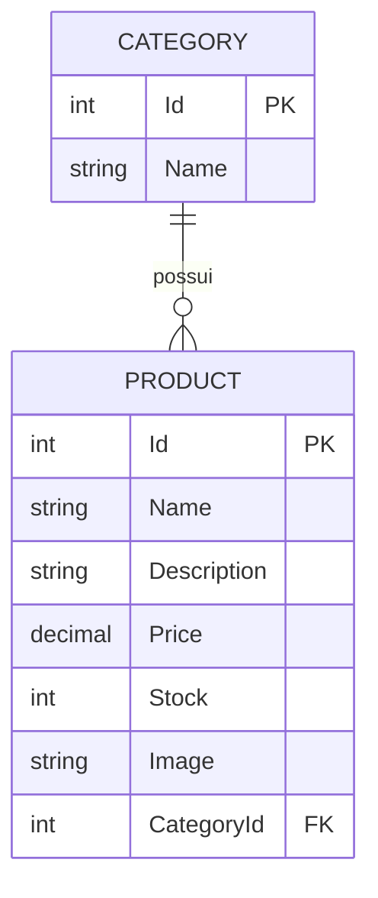

# Banco de dados

Baseado em `CleanArcMvc.Data/Context/ApplicationDbContext.cs`, `CleanArcMvc.Data/EntitiesConfiguration` e nas migrations em `CleanArcMvc.Data/Migrations`.

## Tecnologia

- **SGBD**: SQL Server (`Microsoft.EntityFrameworkCore.SqlServer`).
- **Acesso a dados**: Entity Framework Core 5, abordagem Code First.
- **Contexto**: `ApplicationDbContext`, que estende `IdentityDbContext<ApplicationUser>` — ou seja, combina as tabelas de domínio da aplicação com as tabelas padrão do ASP.NET Core Identity no mesmo banco.

## Entidades e relacionamento



- `Category` (`CleanArcMvc.Domain.Entities.Category`): `Id`, `Name` (obrigatório, 3–100 caracteres via validação de domínio), coleção de `Products`.
- `Product` (`CleanArcMvc.Domain.Entities.Product`): `Id`, `Name`, `Description`, `Price`, `Stock`, `Image`, `CategoryId` (chave estrangeira), navegação para `Category`.
- Relacionamento: um `Category` para muitos `Product`, com exclusão em cascata (`FK_Products_Categories_CategoryId`, `onDelete: Cascade`, ver `Migrations/20240801192626_Inicial.cs`).
- Mapeamento fino de colunas/constraints está em `EntitiesConfiguration/CategoryConfiguration.cs` e `EntitiesConfiguration/ProductConfiguration.cs`.

Além das tabelas de domínio, o schema inclui as tabelas padrão do ASP.NET Core Identity (`AspNetUsers`, `AspNetRoles`, `AspNetUserRoles`, etc.), adicionadas pela migration `AddIdentityTables`.

## Migrations

| Migration | Conteúdo confirmado |
|---|---|
| `20240801192626_Inicial` | Cria as tabelas `Categories` e `Products`, com chave estrangeira e cascade delete; insere 3 categorias de seed. |
| `20240801194802_SeedProducts` | Ajustes de seed relacionados a produtos/categorias. |
| `20240808223407_AddIdentityTables` | Adiciona as tabelas do ASP.NET Core Identity ao schema (`ApplicationDbContext` passa a herdar de `IdentityDbContext`). |
| `20240810191234_IdentityTable` | Migration vazia (sem alterações em `Up`/`Down`) — provavelmente gerada por um `dotnet ef migrations add` sem mudanças de modelo pendentes no momento. |

## Seed de dados

- **Categorias**: inseridas via migration `Inicial` — `Material Escolar` (Id 1), `Eletrônicos` (Id 2), `Acessórios` (Id 3).
- **Usuários e papéis**: **não** vêm de migration; são criados em tempo de execução pela aplicação `CleanArcMvc.WebUI`, via `ISeedUserRoleInitial.SeedRoles()`/`SeedUsers()` (papéis `User` e `Admin`, dois usuários de exemplo). Ver [Configuração no README](../README.md#configuração) sobre o cuidado com essas credenciais de exemplo.

## Aplicando as migrations

```bash
dotnet ef database update --project CleanArcMvc.Data --startup-project CleanArcMvc.WebUI
```

Requer a connection string `ConnectionStrings:DefaultConnection` configurada no `appsettings.json` do projeto de startup utilizado (`CleanArcMvc.WebUI` ou `CleanArcMvc.API`).
